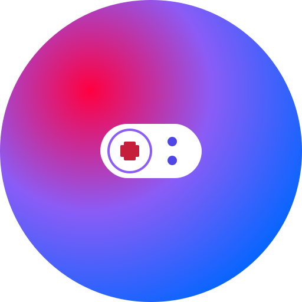

# 🎮 VIN Tournament - eSports Gaming Platform

<div align="center">
  

**A modern, responsive eSports tournament platform built with React and Firebase**

[](https://reactjs.org/)
[](https://firebase.google.com/)
[](https://tailwindcss.com/)
[](https://www.framer.com/motion/)

</div>

## ✨ Features

### 🏆 **Tournament Management**

- **Create Tournaments**: Organize gaming competitions with custom rules
- **Join Tournaments**: Participate in various gaming tournaments
- **Real-time Updates**: Live tournament status and participant tracking
- **Prize Pool Management**: Automated prize distribution system

### 🎮 **Gaming Support**

- **Multiple Games**: BGMI, Free Fire, Valorant, Call of Duty Mobile, and more
- **Various Formats**: Solo, Duo, Squad, 5v5, Battle Royale
- **Custom Tournaments**: Flexible tournament creation options

### 💳 **Payment Integration**

- **Entry Fees**: Secure payment processing for tournament entries
- **Multiple Payment Methods**: UPI, Credit/Debit Cards, Net Banking
- **Prize Distribution**: Automated winner payouts
- **Payment History**: Complete transaction tracking

### 👤 **User Experience**

- **User Authentication**: Secure Firebase authentication
- **User Profiles**: Comprehensive player statistics and achievements
- **Responsive Design**: Optimized for mobile, tablet, and desktop
- **Real-time Notifications**: Toast notifications for all actions

### 🎨 **Modern UI/UX**

- **Gradient Animations**: Beautiful animated backgrounds
- **Framer Motion**: Smooth page transitions and interactions
- **Dark Theme**: Gaming-focused dark interface
- **Mobile-First**: Fully responsive design

## 🚀 Quick Start

### Prerequisites

- Node.js (v16 or higher)
- npm or yarn
- Firebase account

### Installation

1. **Clone the repository**

   ```bash
   git clone https://github.com/yourusername/vin-tournament.git
   cd vin-tournament
   ```

2. **Install dependencies**

   ```bash
   npm install
   ```

3. **Firebase Setup**

   - Create a Firebase project at [Firebase Console](https://console.firebase.google.com/)
   - Enable Authentication (Email/Password)
   - Create Firestore database
   - Copy your Firebase config

4. **Environment Configuration**

   ```bash
   # Create .env file in root directory
   VITE_FIREBASE_API_KEY=your_api_key
   VITE_FIREBASE_AUTH_DOMAIN=your_auth_domain
   VITE_FIREBASE_PROJECT_ID=your_project_id
   VITE_FIREBASE_STORAGE_BUCKET=your_storage_bucket
   VITE_FIREBASE_MESSAGING_SENDER_ID=your_sender_id
   VITE_FIREBASE_APP_ID=your_app_id
   ```

5. **Start Development Server**

   ```bash
   npm run dev
   ```

6. **Open your browser**
   ```
   http://localhost:5173
   ```

## 🛠️ Tech Stack

- **Frontend**: React 18, Vite
- **Styling**: Tailwind CSS, Framer Motion
- **Backend**: Firebase (Authentication, Firestore)
- **Icons**: Lucide React
- **Notifications**: React Hot Toast
- **3D Effects**: Three.js, Vanta.js

## 📱 Mobile Responsive

The platform is fully optimized for all devices:

- **Mobile**: < 640px
- **Tablet**: 640px - 1024px
- **Desktop**: > 1024px

## 🔧 Performance Optimizations

- **Lazy Loading**: Components loaded on demand
- **Caching**: Intelligent data caching with TTL
- **Optimized Queries**: Efficient Firebase queries
- **Image Optimization**: Responsive images and lazy loading

## 🎯 Core Features Implemented

- ✅ User Authentication & Profiles
- ✅ Tournament Creation & Management
- ✅ Tournament Participation System
- ✅ Payment Integration (Mock)
- ✅ Real-time Updates
- ✅ Mobile Responsive Design
- ✅ Performance Optimizations

## 🚀 Deployment

### Build for Production

```bash
npm run build
```

### Deploy to Firebase Hosting

```bash
npm install -g firebase-tools
firebase login
firebase init hosting
firebase deploy
```

## 🤝 Contributing

1. Fork the repository
2. Create your feature branch (`git checkout -b feature/AmazingFeature`)
3. Commit your changes (`git commit -m 'Add some AmazingFeature'`)
4. Push to the branch (`git push origin feature/AmazingFeature`)
5. Open a Pull Request

## 📄 License

This project is licensed under the MIT License - see the [LICENSE](LICENSE) file for details.

## 🙏 Acknowledgments

- React team for the amazing framework
- Firebase for backend services
- Tailwind CSS for styling utilities
- Framer Motion for animations
- All the gaming community for inspiration

---

<div align="center">
  <p>Made with ❤️ for the gaming community</p>
  <p>🎮 <strong>Level Up Your Game</strong> 🏆</p>
</div>
